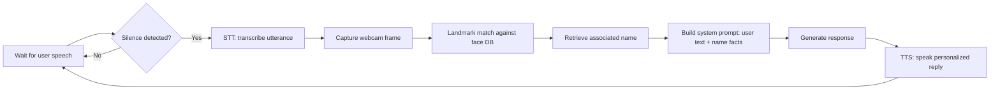

# Visum Dei

Inspiration for this project idea came from discussions around contextual privacy and ongoing controversy in the area of facial recognition. It shares many similarities to a recent Harvard project and other face recognition controversies (ex. Clearview AI). Please refer to [this document](https://docs.google.com/document/d/1iWCqmaOUKhKjcKSktIwC3NNANoFP7vPsRvcbOIup_BA/preview?tab=t.0) to learn more about how to protect your privacy.

---

## Overview 

I created an interactive installation about contextual privacy and face recognition. The system listens for speech, takes a quick webcam photo, matches facial landmarks against a small precomputed database, and uses the matched name to generate a personalized, spoken response. The purpose is to make ambient recognition visible and ask practical questions about consent, value, and risk in everyday interactions.

## Proposal
   
I propose **Visum Dei (the sight of a god)**:  

A focused, end-to-end demo that shows how identity can be captured and used in real time: speech detection → STT → webcam snapshot → facial-landmark match → name retrieval → prompt conditioning → TTS reply → repeat. The build runs locally (Raspberry Pi + USB webcam), uses cached embeddings from a small, precomputed face set (ex. InsightFace), and calls a lightweight local LLM via Ollama for response text. The goal is not high accuracy but a clear, observable interaction that makes recognition, and its social impact, immediately visible.

We will compare variants to study comfort and consent:
- **Identity use:** direct name vs. indirect reference vs. anonymous mode  
- **Disclosure:** with vs. without upfront consent text; inline “why” explanations  
- **Transparency:** show/hide match confidence; visible opt-out toggle

Data handling is intentionally minimal: the face set is small and local, temporary snapshots are deleted after matching, and no cloud storage is used. Participants are informed of the process, can opt out at any time, and can request deletion of their entry from the local set.

> #### Notice:
> This project has heavy similarities to a [similar Harvard project](https://lil.law.harvard.edu/events/i-xray-lunch/). This idea is not that original and has been in many different contexts throghout the years (ex. [Clearview AI](https://www.forbes.com/sites/roberthart/2024/09/03/clearview-ai-controversial-facial-recognition-firm-fined-33-million-for-illegal-database/)). Relating to myself, I came up with my own version of this idea two years ago during undergrad and working with traffic cameras when the newest python facial landmark detection library came out but never did anything with it. So like how MIT has its slogan "demo or die" I never demo'd or built my idea for this two years ago, and have subsequently been outdone (to great extent!) by these Harvard students. Their project is well recorded and has some good videos of interaction with it- I recommend you check out the following video, and support their privacy safety efforts.
> [Watch the Harvard video](https://github.com/user-attachments/assets/e7b0a26d-7fb8-4843-81f1-5763f8280f30)

**Sketch**  

Below is the interaction loop for how the system listens, captures a frame, identifies user, personalizes reply, speaks, and repeats.

**Interaction loop:**

1. Listens for user input, once user input has stopped being detected, uses STT to record what the user said.
2. Once it has recorded what the user said, it takes a temporary picture with the webcam of the user.
3. This temporary picture is used in a precomputed facial landmark database for similarity to other faces.
4. Finds the most similar face (no threshold was implemented in my version), then returns the name associated with the face.
5. The name associated with the face is fed into a system prompt which guides the system in responding to
    - the user prompt
    - details of the user's name according to the landmark database
    - using TTS to respond to user with a personalized response including their name
6. Repeats to Step 1 again, indefinitely.

**Here is a picture of the device (with webcam attached):**

## Components

To create the facial landmark database, we needed to have some faces for usage. **For educational and research purposes only,** I created a small database of the Linkedin headshots of people in my Interactive Device Design class with Wendy Ju. This database was created by scraping the list of names from the Canvas class page, then using a Linkedin headshot Selenium scraper. The automated browser used a logged-in Linkedin session, searched for each name + "Cornell Tech", found the most relevant person, and downloaded their Linkedin headshot (with the format `FIRST_LAST_LINKEDINID.jpeg`).

> #### Notice:
> It is important to note that users with no Linkedin headshot (or an avatar instead of an IRL face) could not be identified as no facial landmarks could be computed for them. 

I then used the Python library Insightface with the Linkedin headshot folder and created a script that matched an input image to the most likely face from the Linkedin headshot folder. This was a bit slow (around 10s) for each call, since it would calculate the embeddings for the entire folder and the embedding for the input image and compare them. I resolved this down to <2s by caching the embeddings of the Linkedin headshot folder (since we would be comparing against that folder everytime).

For privacy reasons, I have not included the source code for the Selenium scraper for Linkedin headshots. Please reach out to my [email address](mailto:shl225@cornell.edu) if you would like to have it.

My system involves the pipeline described in the interaction loop above, consisting of the following files:

* `master.py` : an infinitely running one-shot script which orchestrates the following module python scripts in the pipeline order of the interaction loop.
* `face_server.py` : a server running on port `7860` which uses the precomputed embeddings and Insightface to find the most similar headshot and retrieve the relevant name.
* `love_server.py` : a server running on port `7861` which queries Ollama with the user's input, a system prompt, and relevant name from `face_server`, then outputs a response to the user's query.
* `greet_name_piper.py` : an executable one-shot script which is an upgraded version of our STT that uses Python Piper STT library, immediately outputs via speaker the audio, and is the final module to be called.
  
## Results

Since the interaction for my device was simple, just an Ollama chatbot with the additional information of knowing the user's name, I put more emphasis on the discussion/debriefing after the interaction. I believe the importance of this project, similar to the Harvard one, is to encourage discussion around contextual privacy.

The interaction would be somewhat slow since even though the landmark facial recognition was done in under 2s on average, text generation and subsequent TTS often took 10s plus. This led to a disrepency between the user asking a question, then needing to wait around 10s for an answer, which felt somewhat awkward. I believe this could easily be fixed by offloading to a powerful PC for the text generation etc. so that the local RPI5 is only doing minimal computational tasks. Another issue was that some of the Linkedin headshots were of different points of view of a face than the current point of view of the person facing the camera, causing some misidentification. As always, it is important to mention that bias still exists in face recognition models and could be seen sometimes even in this toy example, with certain ethnicities being more prone to misidentification.

I compare interactions and describe some lessons and some future improvements of the current system below:
- WoZ interactions, and autonomous ones for that matter, can feel quite unrealistic if the pacing/timing is off. This was readily apparent in my system with the ~10s response times, and it makes it less of an interaction and more of a waiting game. The simple and easy fix to this would be to offload heavy computational tasks to more powerful PCs.
- As noted by several participants and spectators, having the system say the user's name directly is quite straightforward and puts the user on their defensive immediately, wondering "How did this robot know my name?". To this extent, better '*social engineering*' experiments could be conducted. Please see the Harvard video above for a good example of this where they interact with Boston residents not by directly saying their name, but by rather saying an association or relative of that person. This lowers the defensive wall for the user and elicits a more natural reaction than one where the user is immediately put on guard. This is a bit deceitful of course, so please note that these thoughts are being expressed for educational reasons only, and I do not encourage these types of insincere interactions.
- The system sometimes did not elicit quality responses to user queries which led to confusion on the user's side. This could be solved with a higher quality language model (at the cost of speed).
- It was readily apparant that the webcam was being used for the face recognition, and participants quickly gleaned this once they heard their name being spoken. I wonder if there is a way of disguising the webcam so that the participant does not realize it is face recognition. What different interactions could occur from this? Would the paricipant believe that their name is just in the knowledge-base of the LLM, some voice recognition is being done, etc.? I think it would be interesting to explore what reasons users can come up for *why* a privacy breach is occurring. It might give an insight into what people believe are the most privacy-breaching technologies of the current day.
- It was raised by a few participants that they would be okay with the interaction if they had "consented" to it. They defined this consent as being given an explicit ask by the robot about opting into recognition, and then affirming that the robot could use sensor information to guess who they were.

Along with the above reflections, I believe an LLM might be able to deny the privacy breach if fine-tuned on a specific dataset. Similar to how current LLMs rely on RL of human-LLM conversations to have larger databases for training, I believe that the same sort of thing can be done with privacy-breach human-LLM conversations. Conversations where privacy has been breached by the LLM are quite different than normal conversations and would be an interesting database to create and utilize for developing models to better interact in scenarios where there is a lessened sense of privacy.

Other sensing modalities (and perhaps more important) would be voice recognition. A camera can only see in a certain range of view- and within that view several actors may exist, while sound can come from anywhere- and from any actor. Therefore, an easy issue to see would be if there were two people in front of the camera of this system and only one of them is speaking. The same notion goes for if the person interacting with the robot is out of the field of the view of the camera. There is no detection being done for `is_speaking`, or rotating of the camera to face audio source, so the model will try to identify whichever individual is in camera-view after the audio source has elapsed speaking and could be completely wrong about who to address. With voice recognition, the model could recognize and assign names to each voice and be able to converse personally even while blind (no camera). 

**Video Demo:**

https://github.com/user-attachments/assets/ebc845f4-f293-4596-ba4a-90ff4e30adb1

## Discussion

As the purpose of my interaction was more of an experimental demo to encourage discussion around contextual privacy, I have recorded feedback from several users below.

| Person | Viewpoint |
|---|---|
| **Thomas Knoepffler** | Thomas wants the system to earn any use of your identity with a clear, easy story that a regular person would accept. Just proving it knows your name is not helpful, and it can feel like showing off unless that knowledge unlocks something you actually want. He thinks about it like a trade. If the system asks you to spend a privacy coin, it should hand you something valuable right away, like faster checkout, a smarter default, less typing, or a safer choice. The reason should show up in the moment so you do not have to guess what is happening. Say what you are doing and why you are doing it, for example, “I am using your name to load your saved preferences so you can finish in one tap,” instead of “Hi, Thomas.” He also says you do not always need a big justification for every detail, but if you cross a boundary like revealing that you recognized someone, you should explain why now, what the benefit is, and how to turn it off. Tie identity to a goal, show the payoff quickly, and let people opt out without friction. |
| **Nana Takada** | For Nana, the creepy factor starts when a system recognizes you without telling you first. That collapses the line between being a person in public and being a record in a profile. She draws a clear distinction between visible, announced uses by institutions, like a city posting signs about analytic cameras, and secret, always-on recognition in home devices that you never consented to. If her smart speaker did that, she would return it. The fear behind this is a surveillance state vibe where quiet dossiers get built, corporations aggregate data, and the motives are not clear. Creepy here is when your expectations do not match the hidden capabilities, especially when the company has more power than you do. Good fixes start with upfront disclosure, honest consent, and visible rules that are easy to understand. Do not surprise people. Say what you do, do only that, and prove it. |
| **Miriam Alex** | Miriam focuses on what is necessary for the task. Lots of questions, like “What is the weather in NYC,” do not need identity at all, so using her name adds risk without adding value. She is more comfortable when sensing is explained and when consent is asked in the moment. A simple prompt like “I am scanning your face to personalize your commute alerts, may I proceed?” makes a huge difference. She also points out a tricky feeling. If the system knows who you are but does not say anything, the moment might feel less awkward, but ethically that is weaker because you are not being told what is going on. The practical rule is to minimize data by default, show recognition only when it clearly improves the outcome, and bind any personal address to a purpose the user can see. Stay anonymous when you can, escalate only when needed, and make the benefit obvious so the trade feels worth it. |
| **Anonmyous** | Anonymous prefers softer identity cues and short-lived use of recognition. Instead of naming a person outright, point to situational or public details so it feels responsive without locking onto a specific identity. An example would be “I think you are number 33 on Forbes 40 under 40, isn't that right?” rather than calling someone by name out of nowhere. They also note that big organizations invest in social engineering tactics, which creates a power gap between those who hold information and everyone else. To reduce that gap, keep recognition as a one-time flourish, make it clearly optional, and avoid storing it after the moment passes. Prefer public or volunteered facts, avoid status-based callouts that single people out, and cap precision to what the task needs. Save persistent profiles only for explicit opt in, with clear controls and visible benefits. |

